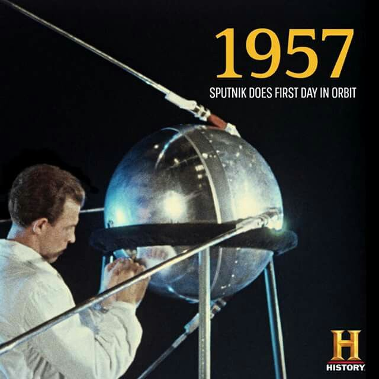
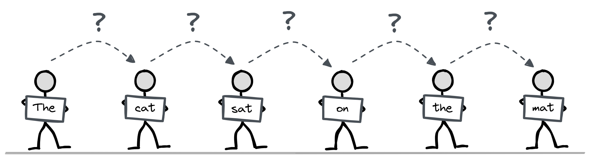
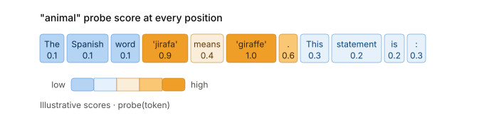
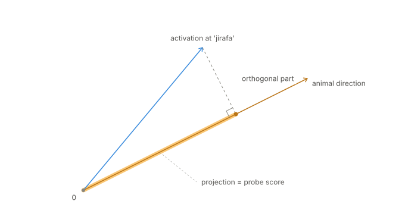
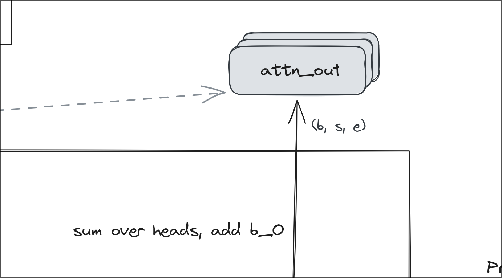
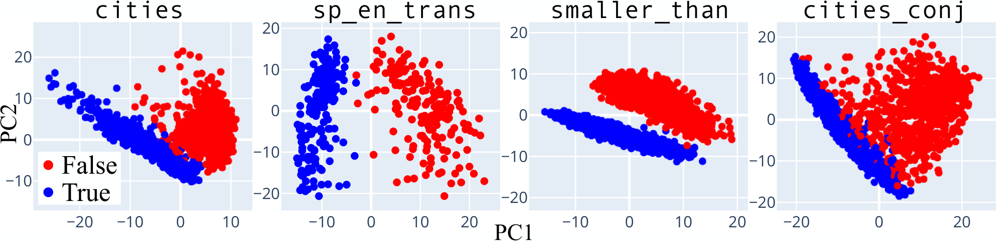
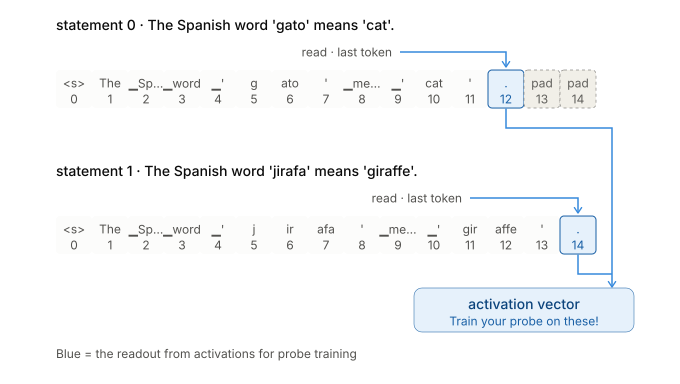
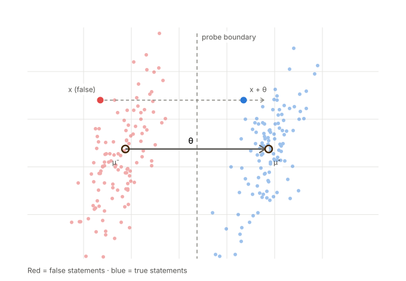
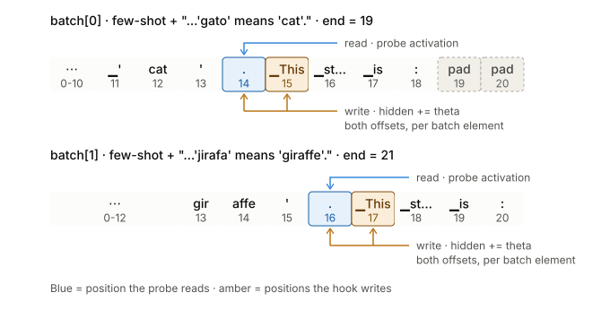

Linear Probes

---

# What is a probe?
An instrument to measure something
- LLM-land: Measure features in the latent space of the residual stream
- Examples:
    - Is the user expressing positive sentiment?
    - Is the statement true?
    - Is the assistant answer deceptive?
    - Is this a high-stakes interaction?

---

# Where are probes used?
- Scalable oversight
- Tool for pragmatic mech interp. to understand models
---

# Outline:
- Recap: Attention & Information flow in a transformer 
- Linear Probes: How do they work?
- What data do we train the probe on?
- Empirical result: Probing for truth
- Probe Directions & Causaility
- Summary

---
**Recap**: Attention & Information flow in a transformer

---

# **Linear Probes**: How do they work?

---
# **Linear Probes**: How do they work?

---
# What data do we train the probe on?

- The pre-unembedding residual stream data
- There are other types of probes, i.e attention probes. But we train on the residual stream

---
# Empirical result: Probing for truth

**Is truth linearly separated?**

---
# Yes! (Marks & Tegmark, 2023)

Simple, unambiguous factual statements; with fixed templates

- `cities` - "The city of [X] is in [Y]."
- `sp_en_trans` - "The Spanish word '[X]' means '[Y]'."
- `larger_than` - "x is larger than y."

---

# Training the probe

- Run the prompts through the transformer
- Collect activations
- Train a classifier
    - Examples: Logistic regression or Difference-of-means
- Evaluate

---
# Data to collect: $h_{i,j}$ for token $i$ and layer $j$

---

# Question:
- A probe $\theta_A$ was trained on dataset A
- A is a corpus of texts labaled as poems or shoppinglists
- The LLM is a 9B parameters mixture-of-experts model

**Will $\theta_A$ generalize to dataset B that also linearly separates poems and shoppinglists?**

---

# Probe Directions & Causality

You have seen:
- Concepts like truth is can be linearly represented in activation space
- How to train probes to classify it

Now:
- Do the models actually use the truth-vector?
- What happens if we mess with the models interals using this vector?

---

# Causal Experiment (Activation patching):

- Create a few-shot prompt to predict `true` or `false`
- Add/remove the `truth`-vector $\theta$ to some token positions
- Does adding the vector change the prediction?

---

# Question:

- How much of an effect do you need classify $\theta$ as casually related to truth?
- What if there is a weak effect? What would you do?
- What other effects would make a strong causal relation of $\theta$ non-interesting?
- Why?

---
# How much truth-vector should you add?

---
# How much truth-vector should you add?

Normalize $\theta$ such that

$$
p(\mu^{-}+\theta) = p(\mu^{+})
$$

where $p$ is your probe. 

*See Section 6.1 The Geometry of Truth (Marks & Tegemark, 2023) for more details.*

---
# Where do you add the vector? (Activation patching)

- Why `.` and ` This`? See, Section 3 The Geom. of Truth, Fig. 2.

---
# How do you measure the effect? (NIE)
- $PD^+$ and $PD^-$, the average probability differences $P(\textsf{TRUE}) - P(\textsf{FALSE})$ for $s$ varying over true statements or false statements in `sp_en_trans`, respectively,

- $PD^+_*$ and $PD^-_*$, the average probability differences where $s$ varies over true (resp. false) statements but the probe direction $\theta$ is subtracted (resp. added) to each group (b) hidden state.

*normalized indirect effects* (NIEs)

$$\frac{PD^-_* - PD^-}{PD^+ - PD^-} \quad \text{or} \quad \frac{PD^+_* - PD^+}{PD^- - PD^+}$$

---

# Question:

- We train probes on the various truth datasets from The Geometry of Truth
- Assume the LR probe $\theta_{LR}$ had $0.95$ accuracy and the difference-of-means probe $\theta_{mm}$ had $0.75$ accuracy

**Which $\theta$ do you expect to be more causally related to the truth concept?**

---

# Summary

We learned:
- How to train a probe
- How to test if a probe direction is causally related to a concept like truth

We discussed:
- Probe generalization
- Probe directions & Causality
